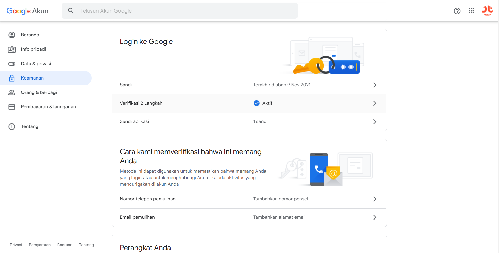
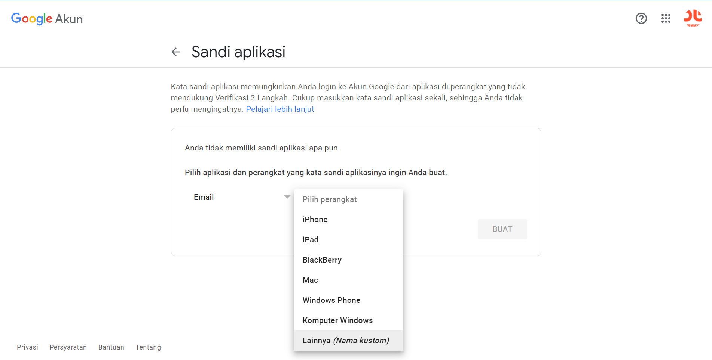
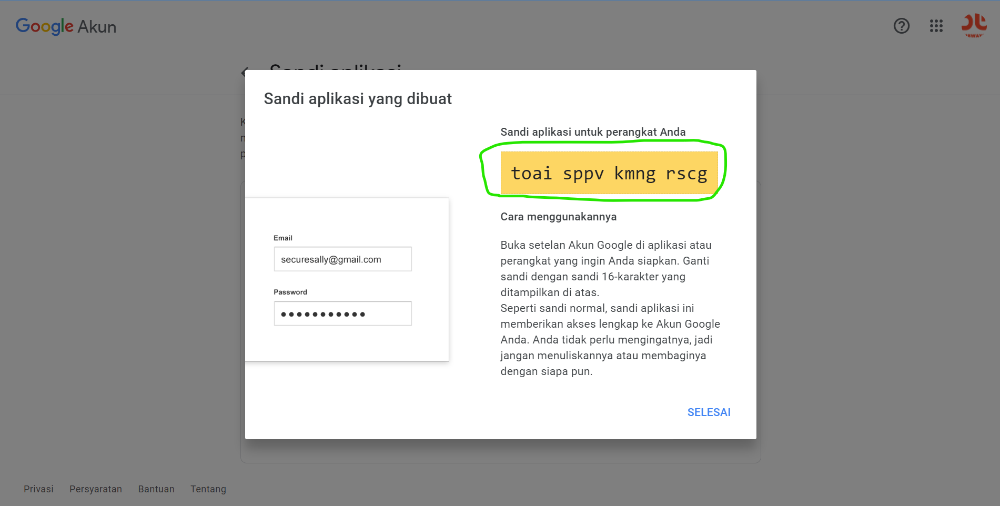
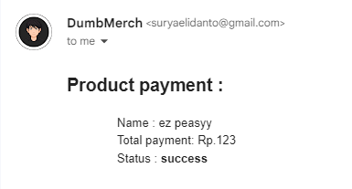

# Gomail

`Gomail` is a simple and efficient package to send emails.

## Prepare

- Install [gomail](https://pkg.go.dev/gopkg.in/gomail.v2) package on server side

  ```text
  go get gopkg.in/gomail.v2
  ```

* Make sure Add email & password to your `.env` file (server side) :

  ```text
  SYSTEM_EMAIL=xxxxxxxxx@gmail.com
  SYSTEM_PASSWORD=xxxxxxxxx
  ```

* How to get your gmail account password application:

  - Make doing 2 step verification & click `Password App`

    

  - Select Application & Device

    

  - On Yellow Box is your `Password App`, copy and paste into `.env`

    

## Handle send email on backend

> File : `server/handlers/transaction.go`

- Import gomail :

  ```go
  "gopkg.in/gomail.v2"
  ```

* Function for handle send email :

  ```go
  func SendMail(status string, transaction models.Transaction) {

    if status != transaction.Status && (status == "success") {
      var CONFIG_SMTP_HOST = "smtp.gmail.com"
      var CONFIG_SMTP_PORT = 587
      var CONFIG_SENDER_NAME = "DumbMerch <demo.dumbways@gmail.com>"
      var CONFIG_AUTH_EMAIL = os.Getenv("EMAIL_SYSTEM")
      var CONFIG_AUTH_PASSWORD = os.Getenv("PASSWORD_SYSTEM")

      var productName = transaction.Product.Name
      var price = strconv.Itoa(transaction.Product.Price)

      mailer := gomail.NewMessage()
      mailer.SetHeader("From", CONFIG_SENDER_NAME)
      mailer.SetHeader("To", transaction.Buyer.Email)
      mailer.SetHeader("Subject", "Transaction Status")
      mailer.SetBody("text/html", fmt.Sprintf(`<!DOCTYPE html>
      <html lang="en">
        <head>
        <meta charset="UTF-8" />
        <meta http-equiv="X-UA-Compatible" content="IE=edge" />
        <meta name="viewport" content="width=device-width, initial-scale=1.0" />
        <title>Document</title>
        <style>
          h1 {
          color: brown;
          }
        </style>
        </head>
        <body>
        <h2>Product payment :</h2>
        <ul style="list-style-type:none;">
          <li>Name : %s</li>
          <li>Total payment: Rp.%s</li>
          <li>Status : <b>%s</b></li>
        </ul>
        </body>
      </html>`, productName, price, status))

      dialer := gomail.NewDialer(
        CONFIG_SMTP_HOST,
        CONFIG_SMTP_PORT,
        CONFIG_AUTH_EMAIL,
        CONFIG_AUTH_PASSWORD,
      )

      err := dialer.DialAndSend(mailer)
      if err != nil {
        log.Fatal(err.Error())
      }

      log.Println("Mail sent! to " + transaction.Buyer.Email)
    }
  }
  ```

* Add sendEmail function on conditional notification function with two params (`status`,`orderId`)

  ```javascript
  transaction, _ := h.TransactionRepository.GetTransaction(order_id)

	if transactionStatus == "capture" {
		if fraudStatus == "challenge" {
			// TODO set transaction status on your database to 'challenge'
			// e.g: 'Payment status challenged. Please take action on your Merchant Administration Portal
			h.TransactionRepository.UpdateTransaction("pending", order_id)
		} else if fraudStatus == "accept" {
			// TODO set transaction status on your database to 'success'
			SendMail("success", transaction)
			h.TransactionRepository.UpdateTransaction("success", order_id)
		}
	} else if transactionStatus == "settlement" {
		// TODO set transaction status on your databaase to 'success'
		SendMail("success", transaction)
		h.TransactionRepository.UpdateTransaction("success", order_id)
	} else if transactionStatus == "deny" {
		// TODO you can ignore 'deny', because most of the time it allows payment retries
		// and later can become success
		h.TransactionRepository.UpdateTransaction("failed", order_id)
	} else if transactionStatus == "cancel" || transactionStatus == "expire" {
		// TODO set transaction status on your databaase to 'failure'
		h.TransactionRepository.UpdateTransaction("failed", order_id)
	} else if transactionStatus == "pending" {
		// TODO set transaction status on your databaase to 'pending' / waiting payment
		h.TransactionRepository.UpdateTransaction("pending", order_id)
	}
  ```
  - Make doing 2 step verification & click `Password App`

    
