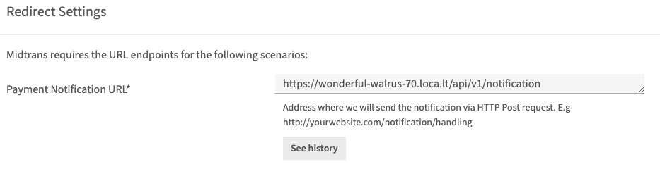
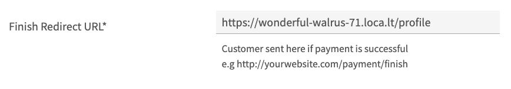

# Payment gateway with midtrans

`Midtrans` is a payment gateway that facilitates the needs of online businesses by providing services in various payment methods. This service allows industry players to operate more easily and increase sales. The payment methods provided are card payment, bank transfer, direct debit, e-wallet, over the counter, and others.

## Prepare

#### How to use Localtunnel or Ngrok for create public URLs

- Make sure application is running using `go run main.go` on server side and using `npm start` on client side

- Localtunnel

  - Open new terminal

  - Install [Localtunnel](https://localtunnel.github.io/www/) globally to make it accessible anywhere :

    ```test
      npm install -g localtunnel
    ```

  * Run localtunnel with port `3000` for client side :

    ```text
      lt --port 3000
    ```

  * Run localtunnel with port `5000` for server side :

    ```text
    lt --port 5000
    ```

- Ngrok

  - Download Ngrok [here](https://ngrok.com/download)

  - Make sure Add authtoken

    ```bash
    ./ngrok config add-authtoken <token>
    ```

  - Start a tunnel

    ```bash
    ./ngrok http <backend_port>
    ```

#### Configuration on midtrans

- Create [midtrans](https://midtrans.com/) account and login

* Insert public URLs for Payment Notification :

  > Path : `settings/configuration`

  

  Reference : [Http notification / Webhooks of Payment Status](https://docs.midtrans.com/en/after-payment/http-notification)

* Insert public URLs for Redirection Finish URL :

  > Path : `settings/snap preferences` and scroll down

  

#### Installation

- Install `midtrans-go` on server side

  ```bash
  go get -u github.com/midtrans/midtrans-go
  ```

#### Environment Variable

- Make sure to complete the `.env `file

  ```env
  SECRET_KEY=suryaganteng
  PATH_FILE=http://localhost:5000/uploads/
  SERVER_KEY=your_midtrans_server_key...
  CLIENT_KEY=your_midtrans_client_key
  EMAIL_SYSTEM=email_here...
  PASSWORD_SYSTEM=password_app...
  ```

# Server side (Backend)

`SNAP` is a payment portal that allows merchants to display the Midtrans payment page directly on the website.

API request should be done from merchant backend to acquire Snap transaction token by providing payment information and Server Key. There are at least three components that are required to obtain the Snap token (`server_key`, `order_id`, `gross_amount`)

### Modify transaction handlers

> File : `server/handlers/transaction.go`

- Import midtrans-go package

  ```go
  "github.com/midtrans/midtrans-go"
  "github.com/midtrans/midtrans-go/snap"
  ```

- On `CreateTransaction` method

  - Create Unique Transaction Id

    ```go
    var transactionIsMatch = false
    var transactionId int
    for !transactionIsMatch {
      transactionId = int(time.Now().Unix())
      transactionData, _ := h.TransactionRepository.GetTransaction(transactionId)
      if transactionData.ID == 0 {
        transactionIsMatch = true
      }
    }
    ```

  - Request token transaction from midtrans

    ```go
    // 1. Initiate Snap client
    var s = snap.Client{}
    s.New(os.Getenv("SERVER_KEY"), midtrans.Sandbox)
    // Use to midtrans.Production if you want Production Environment (accept real transaction).

    // 2. Initiate Snap request param
    req := &snap.Request{
      TransactionDetails: midtrans.TransactionDetails{
        OrderID:  strconv.Itoa(dataTransactions.ID),
        GrossAmt: int64(dataTransactions.Price),
      },
      CreditCard: &snap.CreditCardDetails{
        Secure: true,
      },
      CustomerDetail: &midtrans.CustomerDetails{
        FName: dataTransactions.Buyer.Name,
        Email: dataTransactions.Buyer.Email,
      },
    }

    // 3. Execute request create Snap transaction to Midtrans Snap API
    snapResp, _ := s.CreateTransaction(req)

    return c.JSON(http.StatusOK, dto.SuccessResult{Code: http.StatusOK, Data: snapResp})
    ```

### Handle Notification from midtrans

> File : `server/handlers/transaction.go`

- Create function Notification

  ```go
  func (h *handlerTransaction) Notification(c echo.Context) error {
    var notificationPayload map[string]interface{}

    if err := c.Bind(&notificationPayload); err != nil {
      return c.JSON(http.StatusBadRequest, dto.ErrorResult{Code: http.StatusBadRequest, Message: err.Error()})
    }

    transactionStatus := notificationPayload["transaction_status"].(string)
    fraudStatus := notificationPayload["fraud_status"].(string)
    orderId := notificationPayload["order_id"].(string)

    order_id, _ := strconv.Atoi(orderId)

    fmt.Print("ini payloadnya", notificationPayload)

    if transactionStatus == "capture" {
      if fraudStatus == "challenge" {
        // TODO set transaction status on your database to 'challenge'
        // e.g: 'Payment status challenged. Please take action on your Merchant Administration Portal
        h.TransactionRepository.UpdateTransaction("pending", order_id)
      } else if fraudStatus == "accept" {
        // TODO set transaction status on your database to 'success'
        h.TransactionRepository.UpdateTransaction("success", order_id)
      }
    } else if transactionStatus == "settlement" {
      // TODO set transaction status on your databaase to 'success'
      h.TransactionRepository.UpdateTransaction("success", order_id)
    } else if transactionStatus == "deny" {
      // TODO you can ignore 'deny', because most of the time it allows payment retries
      // and later can become success
      h.TransactionRepository.UpdateTransaction("failed", order_id)
    } else if transactionStatus == "cancel" || transactionStatus == "expire" {
      // TODO set transaction status on your databaase to 'failure'
      h.TransactionRepository.UpdateTransaction("failed", order_id)
    } else if transactionStatus == "pending" {
      // TODO set transaction status on your databaase to 'pending' / waiting payment
      h.TransactionRepository.UpdateTransaction("pending", order_id)
    }

    return c.JSON(http.StatusOK, dto.SuccessResult{Code: http.StatusOK, Data: notificationPayload})
  }
  ```

- Create Update Transaction Repository with 2 parameter (status, transactionId)

  > File: `server/repositories/transaction.go`

  - Declare UpdateTransaction on TransactionRepository interface

    ```go
    UpdateTransaction(status string, orderId int) (models.Transaction, error)
    ```

  - Create UpdateTransaction method

    ```go
    func (r *repository) UpdateTransaction(status string, orderId int) (models.Transaction, error) {
      var transaction models.Transaction
      r.db.Preload("Product").Preload("Buyer").Preload("Seller").First(&transaction, orderId)

      if status != transaction.Status && status == "success" {
        var product models.Product
        r.db.First(&product, transaction.Product.ID)
        product.Qty = product.Qty - 1
        r.db.Save(&product)
      }

      transaction.Status = status
      err := r.db.Save(&transaction).Error
      return transaction, err
    }
    ```

- Create notification routes

  > File: `server/routes/transaction.go`

  ```go
  e.POST("/notification", h.Notification)
  ```

# Client side (Frontend)

Displaying Snap Payment Page on Frontend.

[Reference](https://docs.midtrans.com/en/snap/integration-guide?id=_2-displaying-snap-payment-page-on-frontend)

> File : `client/src/pages/DetailProduct.js`

- Config Snap payment page with useEffect :

  ```javascript
  ...
  useEffect(() => {
    //change this to the script source you want to load, for example this is snap.js sandbox env
    const midtransScriptUrl = "https://app.sandbox.midtrans.com/snap/snap.js";
    //change this according to your client-key
    const myMidtransClientKey = process.env.REACT_APP_MIDTRANS_CLIENT_KEY;

    let scriptTag = document.createElement("script");
    scriptTag.src = midtransScriptUrl;
    // optional if you want to set script attribute
    // for example snap.js have data-client-key attribute
    scriptTag.setAttribute("data-client-key", myMidtransClientKey);

    document.body.appendChild(scriptTag);
    return () => {
      document.body.removeChild(scriptTag);
    };
  }, []);
  ...
  ```

  [Reference](https://docs.midtrans.com/en/other/faq/technical?id=my-developer-uses-react-js-frontend-framework-and-is-unable-to-use-midtransminjssnapjs-what-should-i-do)

* Modify handle buy to display Snap payment page become like this :

  ```javascript
  ...
   const handleBuy = useMutation(async (e) => {
    try {
      e.preventDefault();

      const config = {
        headers: {
          'Content-type': 'application/json',
        },
      };

      const data = {
        product_id: product.id,
        seller_id: product.user.id,
        price: product.price,
      };

      const body = JSON.stringify(data);

      const response = await API.post('/transaction', body, config);
      console.log("transaction success :", response)

      const token = response.data.data.token;
      window.snap.pay(token, {
        onSuccess: function (result) {
          /* You may add your own implementation here */
          console.log(result);
          navigate("/profile");
        },
        onPending: function (result) {
          /* You may add your own implementation here */
          console.log(result);
          navigate("/profile");
        },
        onError: function (result) {
          /* You may add your own implementation here */
          console.log(result);
          navigate("/profile");
        },
        onClose: function () {
          /* You may add your own implementation here */
          alert("you closed the popup without finishing the payment");
        },
      });
    } catch (error) {
      console.log("transaction failed : ", error);
    }
  });
  ...
  ```
